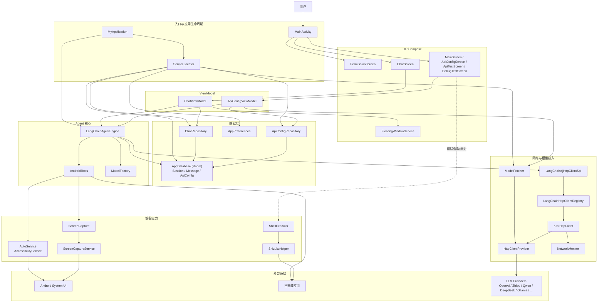
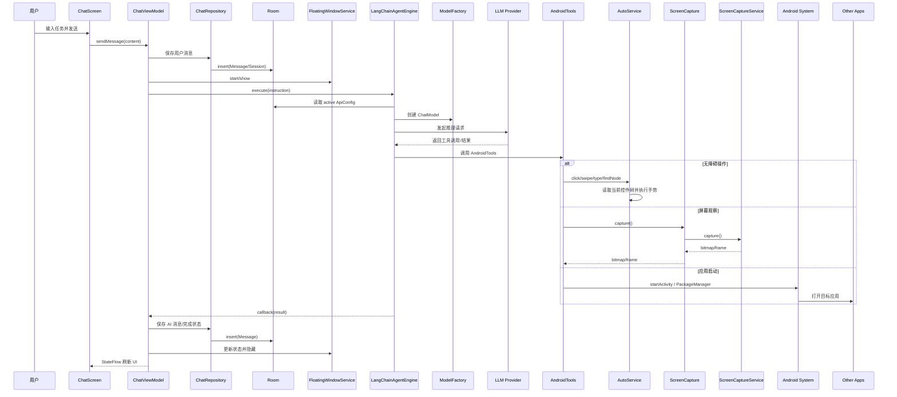

# 项目架构图

本文基于当前仓库实现整理，重点覆盖实际接入的主链路：`Compose UI -> ViewModel -> Repository/Agent -> Android 能力/网络 -> 外部服务`。

## 1. 架构总览

## 2. 核心执行链路

下面这条链路对应“用户在聊天页发送一句话，Agent 判断并执行手机自动化”。

## 3. 模块职责

- `ui/`：Compose 页面与组件，负责权限引导、聊天、配置管理、调试页。
- `ui/chat/`：聊天主入口，`ChatViewModel` 负责会话、消息、Agent 执行和悬浮窗联动。
- `agent/`：Agent 运行时；`LangChainAgentEngine` 负责模型初始化、工具注册、状态流转。
- `agent/langchain/`：模型工厂与 LangChain 相关适配；`RAGManager` 当前存在但处于禁用状态。
- `accessibility/`：`AutoService` 提供点击、滑动、输入、控件树检索等自动化能力。
- `screen/`：基于 `MediaProjection` 的屏幕捕获，使用前台服务 `ScreenCaptureService` 承载。
- `data/`：Room 持久化层，存储聊天会话、消息、API 配置。
- `network/`：统一 HTTP 基础设施；一条给 `ModelFetcher` 用，另一条通过 LangChain4j SPI 接给 Agent。
- `shell/`：Shizuku 辅助能力，主要用于更可靠的应用列表、应用启动和调试。
- `di/`：当前使用轻量级 `ServiceLocator`，尚未引入 Hilt/Koin。

## 4. 说明

- 当前主业务链路是“聊天驱动的手机自动化”，不是传统的 MVC 页面应用。
- `ShellExecutor` 目前更多出现在调试/辅助场景，主自动化链路仍以 `AndroidTools + AutoService` 为核心。
- `RAGManager` 虽保留在代码中，但当前版本没有真正接入运行链路。
