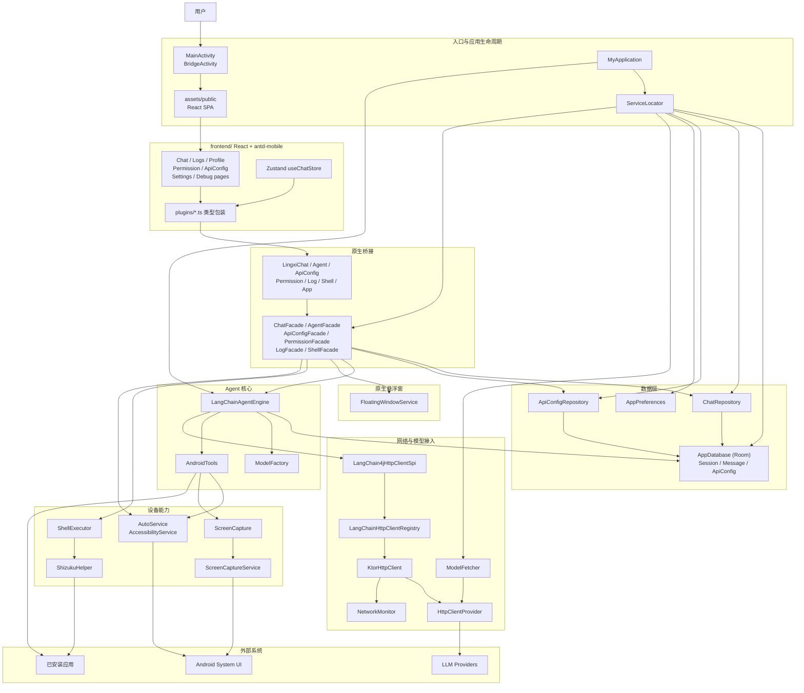
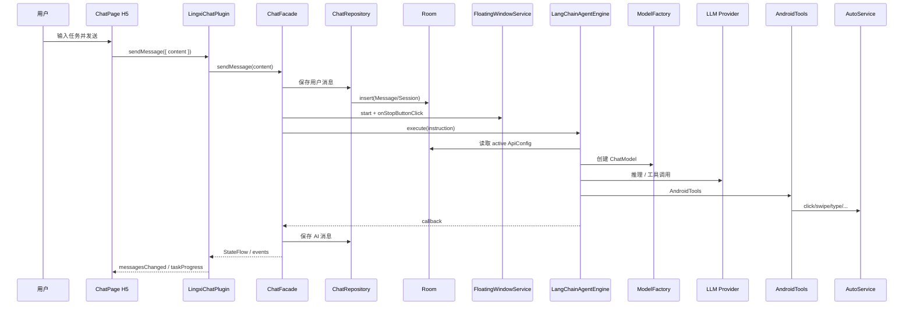

# 项目架构图

本文基于当前仓库实现整理，重点覆盖主链路：  
**React + antd-mobile（H5）→ Capacitor 插件 → Facade → Repository/Agent → Android 能力/网络 → 外部服务**。

> Compose 应用内 UI 已在 Phase 4 拆除；唯一保留的原生 UI 是系统级 `FloatingWindowService`（经典 View）。

## 1. 架构总览

## 2. 核心执行链路

用户在 H5 聊天页发任务 → 插件 → ChatFacade → Agent → 设备自动化。

## 3. 模块职责

- `frontend/`：React + antd-mobile SPA；路由、页面、Zustand、插件 TS 包装与 web mock。
- `app/.../plugins/`：Capacitor 自定义插件（JSON 编解码 + 协程调度）。
- `app/.../bridge/`：无 UI 依赖的 Facade（Chat / Agent / ApiConfig / Permission / Log / Shell）。
- `app/.../ui/overlay/`：唯一保留原生 UI — `FloatingWindowService` 任务悬浮窗。
- `agent/`：`LangChainAgentEngine` 模型初始化、工具注册、状态流转。
- `accessibility/`：`AutoService` 点击、滑动、输入、控件树。
- `screen/`：MediaProjection 截屏 + `ScreenCaptureService`。
- `data/`：Room 会话 / 消息 / API 配置。
- `network/`：Ktor + LangChain4j SPI + `NetworkMonitor`。
- `shell/`：Shizuku 应用列表 / 启动 / 调试命令。
- `di/`：轻量 `ServiceLocator`。

## 4. 说明

- 应用内 UI **不再使用 Jetpack Compose**；`applicationId` 仍为 `com.example.myapplication`。
- 密钥只经原生 Room / DataStore；H5 列表仅见脱敏 `apiKeyMasked`。
- 主自动化链路：`AndroidTools + AutoService`；Shell 多为调试辅助。
- 契约真源：`docs/bridge-api.md`。迁移清单：`docs/compose-migration-inventory.md`。
