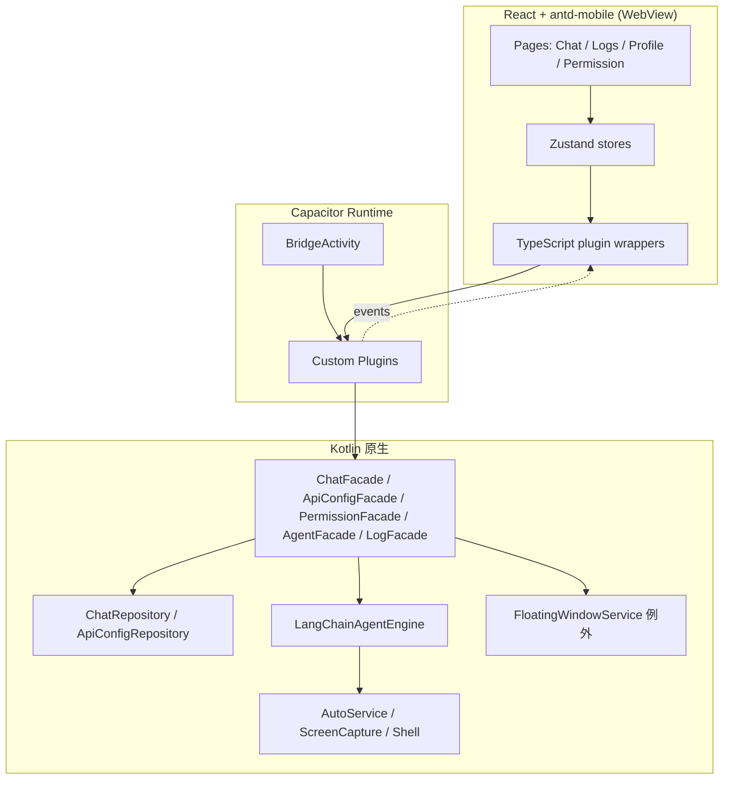

# 灵犀：UI 层迁移至 React + antd-mobile（H5）实施计划

> **For agentic workers:** 可按阶段拆任务执行。推荐先完成 Phase 0–1（桥接契约与壳工程），再并行迁移页面。步骤用 checkbox 跟踪。  
> **栈变更记录：** 前端定为 **React + antd-mobile**；不再使用 Ionic / Vue 作为 UI 方案。原生壳仍用 **Capacitor**。

**Goal:** 将灵犀的**应用内 UI** 从 Jetpack Compose 全面替换为 **React + antd-mobile 移动 Web（H5）**，设备自动化与 Agent 能力继续运行在 Kotlin 原生层，通过 Capacitor 插件桥接。

**Architecture:** 采用「壳 + 双层」：Capacitor `BridgeActivity` 承载 React SPA WebView；`accessibility` / `agent` / `screen` / `shell` / `data` / `network` 保留 Kotlin；原 ViewModel 逻辑下沉为可被插件调用的 **Facade / UseCase**；实时状态用 Capacitor `notifyListeners` 推送到 H5。

**Tech Stack:** React 18 + TypeScript + Vite + **antd-mobile 5** + React Router + Zustand（或 Redux Toolkit）+ Capacitor 7；Android 侧 Kotlin 17、现有 Room / LangChain4j / Ktor / Shizuku 不变。

## Global Constraints

- **UI 层禁止新增 Compose / XML 页面**（系统悬浮窗 `FloatingWindowService` 为唯一例外，见 §3.4）
- **前端只用 React + antd-mobile**；不引入 Ionic 组件体系
- **不改 `applicationId`**（当前 `com.example.myapplication`），避免覆盖安装与 Appium 包名失效
- **minSdk 26、targetSdk 36、Java/Kotlin 17** 保持与现工程一致
- **Agent 与无障碍自动化逻辑不迁到 JS**（性能、权限、Accessibility API 均要求原生）
- **API Key 等密钥不进 H5 持久化明文**；配置读写只经原生 Room / DataStore
- 中文产品文案统一应用名「灵犀」；代码与 JSON 字段保持英文标识符

---

## 1. 现状与边界

### 1.1 当前 UI 清单（待替换）

| 区域 | 现有实现 | 职责 |
|------|----------|------|
| 入口导航 | `MainActivity` + Compose `MainApp` | 权限门闸、底栏、Profile 子页 |
| 聊天 | `ChatScreen` + `ChatViewModel` | 会话、消息、发任务、取消 |
| 权限 | `PermissionScreen` | 无障碍 / 截屏 / 悬浮窗 / 应用列表 |
| 日志 | `LogScreen` | 运行日志浏览 |
| 我的 / 设置 | `MainScreen`、`ProfileScreen` | 状态开关、任务设置入口 |
| API 配置 | `ApiConfigScreen` + `ApiConfigViewModel` | 多 Provider 配置、拉模型、测连 |
| 调试页 | `ApiTestScreen` / `DebugTestScreen` / `TypeToolTestScreen` | 联调与工具验证 |
| 悬浮窗 | `FloatingWindowService`（经典 View） | 任务执行态悬浮展示与停止 |

### 1.2 必须留在原生层的模块

```
accessibility/   AutoService, NodeParser, ActionExecutor
agent/           LangChainAgentEngine, AndroidTools, ModelFactory, RAG*
screen/          ScreenCapture, ScreenCaptureService
shell/           ShellExecutor, ShizukuHelper
data/            Room, Repository, Preferences
network/         Ktor, CircuitBreaker 相关
api/             ModelFetcher 等
```

### 1.3 迁移后目标架构



主链路（迁移后）：

1. 用户在 H5 聊天页输入指令  
2. `ChatPlugin.sendMessage` → `ChatFacade` → Room 写用户消息 → `LangChainAgentEngine.execute`  
3. Engine 调 `AndroidTools` → 无障碍 / 截屏  
4. Agent 状态经 `AgentPlugin` 事件推到 H5；同时同步 `FloatingWindowService`  
5. 结果消息写 Room，H5 通过 `messagesChanged` 或订阅刷新列表  

---

## 2. 技术选型结论

| 项 | 选择 | 理由 |
|----|------|------|
| UI 框架 | **React 18 + TypeScript** | 团队指定；组件与生态成熟 |
| 组件库 | **antd-mobile 5** | 移动端组件完整（TabBar、List、Form、Popup、Toast、Dialog 等）；中文文档友好 |
| 路由 | **React Router 6** | SPA 路由；配合底栏 / 子页 |
| 构建 | **Vite** | 热更新快；与 Capacitor `webDir` 集成简单 |
| 状态 | **Zustand**（默认） | 轻量；会话 / 消息 / Agent 态足够；也可换 RTK |
| 原生桥 | **Capacitor 7** | WebView 壳 + 自定义插件；**不使用 Ionic UI** |
| 接入方式 | **在现有 Android 工程内嵌入 Capacitor** | 保留 Service、Manifest、Gradle 依赖 |
| 前端目录 | 仓库根 `frontend/` | 与 `app/` 解耦；产物同步到 `app/src/main/assets/public` |

**不采用：**

- Ionic / Vue（已否决；UI 由 antd-mobile 承担）
- Cordova（生态停滞）
- 纯系统 WebView + 自研 `JavascriptInterface`（类型与可维护性弱于 Capacitor）
- 把 LLM Agent 迁到浏览器 / Node
- React Native（需求为 H5，不是原生 RN 渲染）

### 2.1 antd-mobile 使用约定

- 按需引入组件；全局配置 `ConfigProvider`（如有 locale）
- 反馈统一用 `Toast` / `Dialog` / `ActionSheet`，避免再引第二套反馈库
- 列表长数据优先 `List` + 虚拟滚动（聊天历史量大时可用 `react-virtuoso` 等，Phase 2 按需）
- 样式：antd-mobile 默认主题 + 少量 CSS Modules / CSS 变量覆盖品牌色；**不强制**引入 antd（桌面版）

---

## 3. 关键设计决策

### 3.1 原生逻辑下沉：Facade，而不是让插件直接调 ViewModel

Compose ViewModel 依赖 `Application` / `SavedStateHandle` / Compose 生命周期，不适合作为插件入口。

迁移时抽出无 UI 依赖的门面，例如：

```kotlin
// app/.../bridge/ChatFacade.kt（示意）
class ChatFacade(
    private val repository: ChatRepository,
    private val agent: LangChainAgentEngine,
    private val appContext: Context
) {
    fun sessionsFlow(): Flow<List<ChatSessionDto>>
    fun messagesFlow(sessionId: String): Flow<List<ChatMessageDto>>
    fun agentStateFlow(): Flow<AgentStateDto>
    suspend fun createSession(title: String): ChatSessionDto
    suspend fun selectSession(sessionId: String)
    suspend fun deleteSession(sessionId: String)
    suspend fun sendMessage(content: String)
    fun cancelTask()
}
```

`ChatViewModel` 中的业务（会话切换、写消息、启停悬浮窗、调 `execute`）搬入 Facade；插件只做 JSON 编解码与线程调度。

### 3.2 DTO 与 JSON 契约（插件边界）

H5 与原生统一用 **camelCase JSON**。示例：

**ChatMessageDto**

```json
{
  "id": "uuid",
  "timestamp": 1710000000000,
  "type": "user | ai | toolCall | screenshot | status",
  "content": "文本或状态",
  "isSuccess": true,
  "errorMessage": null,
  "toolName": null,
  "parameters": null,
  "result": null,
  "imageBase64": null,
  "isRunning": false
}
```

**AgentStateDto**

```json
{
  "state": "IDLE | READY | RUNNING | COMPLETED | ERROR | CANCELLED",
  "step": "",
  "action": "",
  "thinking": "",
  "result": null,
  "error": null
}
```

**ApiConfigDto**

```json
{
  "id": "uuid",
  "name": "默认",
  "provider": "OPENAI | ZHIPU | ...",
  "apiKeyMasked": "sk-***",
  "baseUrl": "https://...",
  "modelId": "gpt-4o-mini",
  "isActive": true
}
```

写配置时 H5 传完整 `apiKey`；读列表时原生返回 **脱敏** 字段，避免 WebView 调试面板长期暴露密钥。

### 3.3 Capacitor 自定义插件清单

| 插件名 | 方法（示意） | 事件 |
|--------|--------------|------|
| `LingxiChat` | `listSessions`, `createSession`, `selectSession`, `deleteSession`, `listMessages`, `sendMessage`, `cancelTask`, `clearMessages` | `sessionsChanged`, `messagesChanged`, `taskProgress` |
| `LingxiAgent` | `getState`, `reconfigure`, `isConfigured` | `stateChanged` |
| `LingxiApiConfig` | `list`, `create`, `update`, `delete`, `setActive`, `fetchModels`, `testConnection` | `configsChanged` |
| `LingxiPermission` | `getStatus`, `openAccessibilitySettings`, `requestOverlay`, `requestScreenCapture`, `refresh` | `statusChanged` |
| `LingxiLog` | `list`, `clear`, `export` | `logAppended` |
| `LingxiShell`（调试） | `runCommand`, `listPackages` | — |
| `LingxiApp` | `getVersion`, `openUrl` | — |

TypeScript 侧为每个插件生成类型包装（`frontend/src/plugins/*.ts`），页面 **禁止** 直接 `window.Capacitor` 裸调。

### 3.4 悬浮窗例外策略

`SYSTEM_ALERT_WINDOW` 悬浮层跨应用显示，**不在 React 主 WebView 内**。

- **Phase 1–4：** 继续使用现有 `FloatingWindowService`（原生 View）
- **可选后续：** 悬浮窗内部嵌 `WebView` 加载精简 H5 面板；仍属原生 Service 承载
- 计划验收不要求悬浮窗 H5 化

### 3.5 权限与 Activity Result

截屏授权 `MediaProjection` 依赖 `startActivityForResult`。实现方式：

- `MainActivity`（`BridgeActivity`）持有 launcher
- `LingxiPermission.requestScreenCapture` 通过 Activity 插件模式回调
- 结果写入 `ScreenCapture` 后 `notifyListeners("statusChanged")`

无障碍、悬浮窗仅能 `startActivity` 跳系统设置，由用户手动开启；H5 在路由进入 / `App.addListener('resume')` 时调用 `refresh`。

### 3.6 构建与产物

```
frontend/                 # React + antd-mobile 源码
  src/pages/
  src/components/
  src/plugins/
  src/stores/
  capacitor.config.ts     # webDir: dist；android 指向现有 app 模块

app/                      # 现有 Android 应用
  src/main/assets/public  # 同步后的 H5 静态资源（gitignore 或 CI 生成）
  src/main/java/.../bridge/
  src/main/java/.../plugins/
```

推荐脚本：

```bash
# 开发：Vite 热更新（浏览器 mock 插件）
cd frontend && npm run dev

# 集成构建
cd frontend && npm run build
npx cap sync android   # 或自定义同步到 assets/public
./gradlew :app:assembleDebug
```

Gradle 可增加 task：`assembleDebug` 依赖 `frontend:build`（Node 工具链可选；本地无 Node 时允许使用上次产物）。

---

## 4. 仓库目录目标结构

```
phone-assistant/
├── frontend/                          # 新建
│   ├── package.json
│   ├── vite.config.ts
│   ├── capacitor.config.ts
│   ├── index.html
│   ├── src/
│   │   ├── main.tsx
│   │   ├── App.tsx
│   │   ├── router/
│   │   │   └── index.tsx
│   │   ├── theme/
│   │   │   └── global.css
│   │   ├── pages/
│   │   │   ├── ChatPage.tsx
│   │   │   ├── LogsPage.tsx
│   │   │   ├── ProfilePage.tsx
│   │   │   ├── PermissionPage.tsx
│   │   │   ├── ApiConfigPage.tsx
│   │   │   ├── SettingsPage.tsx
│   │   │   ├── ApiTestPage.tsx
│   │   │   ├── DebugTestPage.tsx
│   │   │   └── TypeToolTestPage.tsx
│   │   ├── components/
│   │   │   ├── layout/TabLayout.tsx
│   │   │   ├── chat/MessageBubble.tsx
│   │   │   ├── chat/ChatInputBar.tsx
│   │   │   └── chat/SessionDrawer.tsx
│   │   ├── plugins/                   # Capacitor TS 包装
│   │   ├── stores/                    # Zustand
│   │   ├── types/                     # 与 bridge DTO 对齐
│   │   └── mocks/                     # 浏览器 mock 插件
│   └── tests/
├── app/src/main/java/.../
│   ├── bridge/                        # Facades + DTO
│   ├── plugins/                       # Capacitor Plugin 实现
│   ├── MainActivity.kt                # 改为 BridgeActivity 子类
│   ├── ui/                            # 删除 Compose 页面（悬浮窗保留）
│   └── ...                            # agent/accessibility 等保留
└── docs/superpowers/plans/
    └── 2026-08-06-ionic-h5-migration.md
```

---

## 5. 分阶段实施计划

### Task 1: Phase 0 — 基线与契约冻结（0.5–1 天）

**目标：** 不改行为，只固化桥接契约与验收清单。

- [ ] **0.1** 导出当前页面信息架构与用户路径（权限 → 聊天 → API 配置 → 执行任务）
- [ ] **0.2** 冻结 §3.2 DTO 与 §3.3 插件方法表为 `docs/bridge-api.md`（后续 PR 改契约需同步）
- [ ] **0.3** 列出 Compose 文件删除清单与保留清单（保留 `FloatingWindowService` 与其 drawable）
- [ ] **0.4** 确认 Appium 选择器策略：迁移后改为 WebView 上下文或 `data-testid`（见 Phase 5）

**验收：** 契约文档合并；原生行为无变更。

---

### Task 2: Phase 1 — 壳工程 + 空桥（1–2 天）

**目标：** 安装 APK 后看到 React + antd-mobile 首页；原生插件 `ping` 通。

- [ ] **1.1** 脚手架：
  ```bash
  npm create vite@latest frontend -- --template react-ts
  cd frontend
  npm i antd-mobile react-router-dom zustand
  npm i @capacitor/core @capacitor/cli @capacitor/android
  npx cap init "灵犀" com.example.myapplication --web-dir dist
  ```
- [ ] **1.2** 配置 `capacitor.config.ts`：`appId` 与 `applicationId` 一致；`appName` 为「灵犀」；指向现有 Android `app` 模块
- [ ] **1.3** 接入现有 `app` 模块：`MainActivity` 继承 `BridgeActivity`，去掉 `setContent { Compose }`
- [ ] **1.4** Gradle 引入 Capacitor Android 依赖；`AndroidManifest` 保留全部 Service / Provider
- [ ] **1.5** 实现 `LingxiAppPlugin.echo` / `getVersion`；H5 首页用 antd-mobile `NavBar` + 文案展示版本号
- [ ] **1.6** 底栏骨架：`TabBar` + React Router（Chat / Logs / Profile 空页）
- [ ] **1.7** 浏览器 mock：`import.meta.env.DEV` 下无原生时用内存 mock，保证 `npm run dev` 可调 UI

**验收：**

```bash
cd frontend && npm run build
./gradlew :app:installDebug
# 桌面打开「灵犀」→ antd-mobile UI；控制台无桥接错误；echo 返回 ok
```

**风险：** Compose 与 Capacitor 依赖冲突 → 逐步移除 Compose BOM（Phase 4 末清理）。

---

### Task 3: Phase 2 — Facade 抽取 + Chat / Agent 插件（2–4 天）

**目标：** 聊天主路径在 H5 可用，任务能跑通自动化。

- [ ] **2.1** 新增 `ChatMessageDto` / `ChatSessionDto` / mapper（`data/mapper` 扩展）
- [ ] **2.2** 实现 `ChatFacade`：从 `ChatViewModel` 搬迁 `create/select/delete/send/cancel` 与悬浮窗同步
- [ ] **2.3** 实现 `LingxiChatPlugin` + `LingxiAgentPlugin`（方法 + 事件）
- [ ] **2.4** H5：`ChatPage` + `MessageBubble` + `ChatInputBar` + `SessionDrawer`（`Popup` / `List`）
- [ ] **2.5** Zustand `useChatStore`：订阅 `messagesChanged` / `stateChanged`
- [ ] **2.6** 单元测试：Facade 层用 Robolectric / JVM mock Repository；插件参数校验测试
- [ ] **2.7** 真机/模拟器：发一条指令，确认 Agent + 悬浮窗仍工作

**验收：** 与现 Compose 聊天等价的主路径；Room 中会话/消息可查。

**接口示意（插件）：**

```typescript
// frontend/src/plugins/lingxi-chat.ts
export interface LingxiChatPlugin {
  listSessions(): Promise<{ sessions: ChatSessionDto[] }>;
  createSession(options: { title?: string }): Promise<{ session: ChatSessionDto }>;
  selectSession(options: { sessionId: string }): Promise<void>;
  deleteSession(options: { sessionId: string }): Promise<void>;
  listMessages(options: { sessionId: string }): Promise<{ messages: ChatMessageDto[] }>;
  sendMessage(options: { content: string }): Promise<void>;
  cancelTask(): Promise<void>;
  clearMessages(): Promise<void>;
  addListener(
    eventName: 'sessionsChanged' | 'messagesChanged' | 'taskProgress',
    listener: (data: unknown) => void
  ): Promise<PluginListenerHandle>;
}
```

**Chat 页 antd-mobile 组件建议：**

| 区域 | 组件 |
|------|------|
| 顶栏 | `NavBar`（左侧会话菜单、右侧设置） |
| 会话列表 | `Popup` + `List` + `SwipeAction` |
| 消息流 | 自定义气泡 + 可选虚拟列表 |
| 输入区 | `TextArea` + `Button`；发送中 `DotLoading` / `SpinLoading` |
| 运行中 | `Tag` / `NoticeBar` 展示 Agent 态；取消用 `Dialog.confirm` |

---

### Task 4: Phase 3 — 权限 + API 配置 + 设置（2–3 天）

**目标：** 首次启动权限流与多模型配置完全走 H5。

- [ ] **3.1** `PermissionFacade` + `LingxiPermissionPlugin`（状态查询 / 跳转设置 / 截屏授权）
- [ ] **3.2** `PermissionPage`：`List` + `Button` 四项状态；全部就绪后 `navigate('/tabs/chat', { replace: true })`
- [ ] **3.3** `ApiConfigFacade`（自 `ApiConfigViewModel` 搬迁）+ 插件
- [ ] **3.4** `ApiConfigPage`：`List` 配置项、`Form` + `Popup` 新建/编辑、`Selector` 选 Provider、测连 `Toast`
- [ ] **3.5** `SettingsPage`：`Form` / `Switch` 映射原 `MainScreen`
- [ ] **3.6** `ProfilePage`：`List` 菜单 + Agent 状态 `Tag`
- [ ] **3.7** 活跃配置变更后调用 `langChainAgentEngine.reconfigure()`

**验收：** 清数据冷启动 → 权限页 → 配置 API → 聊天发消息成功。

---

### Task 5: Phase 4 — 日志 / 调试页 + 拆除 Compose（1–2 天）

**目标：** 调试能力齐备；删除无用 Compose UI。

- [ ] **4.1** `LingxiLogPlugin` + `LogsPage`（`List` + 清空）
- [ ] **4.2** `ApiTestPage` / `DebugTestPage` / `TypeToolTestPage`（`Form` + 输出区）
- [ ] **4.3** 删除 `ui/chat/*` Compose、`ui/screens/*`、`ui/theme/*`、`MainActivity` 内 Compose 导航
- [ ] **4.4** 移除 `build.gradle.kts` 中 Compose 依赖与 `buildFeatures.compose`
- [ ] **4.5** 更新 `CLAUDE.md` / `AGENTS.md` / `docs/project-architecture.md`
- [ ] **4.6** ktlint / `compileDebugKotlin` / `assembleDebug` 全绿

**验收：** APK 中 Compose 依赖消失；功能回归通过。

---

### Task 6: Phase 5 — 测试与发布加固（1–2 天）

- [x] **5.1** 插件契约的 JVM 单测（DTO 序列化、Facade 错误路径）— ShellFacade + 既有 Chat/ApiConfig
- [x] **5.2** 前端 vitest：`useChatStore` mock 插件（无 Testing Library 组件树，YAGNI）
- [x] **5.3** 改写 Appium：WebView 上下文 + `data-testid`（`tests/appium/`）
- [x] **5.4** 性能：人工抽测清单写入 `bridge-api.md` §5（无设备 farm，不进 CI）
- [x] **5.5** 安全：`MainActivity.hardenWebView` + 文档（file access / release remote debug）

**验收：** `./gradlew testDebugUnitTest` 绿；Appium 选择器已迁移，真机需 Appium server（文档标明）。

---

## 6. 页面映射（Compose → React + antd-mobile）

| Compose | React 路由 | antd-mobile 建议 |
|---------|------------|------------------|
| `PermissionScreen` | `/permission` | `List` + `Button` + 状态 `Tag` |
| `ChatScreen` + drawer | `/tabs/chat` | `NavBar` + `Popup` 会话 + 气泡列表 + `TextArea` |
| `LogScreen` | `/tabs/logs` | `List` / 虚拟列表 |
| `ProfileScreen` | `/tabs/profile` | `List` + `List.Item` 箭头 |
| `MainScreen` | `/settings` | `Form` + `Switch` |
| `ApiConfigScreen` | `/api-config` | `List` + `Form` in `Popup` |
| `ApiTestScreen` | `/api-test` | `Form` + 结果区 |
| `DebugTestScreen` | `/debug` | `Form` + 等宽输出 |
| `TypeToolTestScreen` | `/type-tool-test` | `Input` / `TextArea` 验证 |
| `FloatingWindowService` | （原生保留） | — |

底栏：antd-mobile `TabBar` → Chat / Logs / 我的（包在 `TabLayout` 内）。

---

## 7. 风险与缓解

| 风险 | 影响 | 缓解 |
|------|------|------|
| WebView 与无障碍节点互相干扰 | Agent 误点到本应用 WebView | 任务执行时可 `moveTaskToBack`；文档约定操作其它 App |
| MediaProjection 授权链路复杂 | 截屏失败 | 权限插件集中在 Activity；真机清单 |
| 事件风暴（高频 state） | H5 卡顿 | 原生 throttle 100–200ms；React 合并 setState |
| Capacitor 与 AGP 版本冲突 | 编不过 | 对齐 Capacitor 7 官方矩阵 |
| Appium 选择器失效 | E2E 全挂 | WebView + `data-testid` |
| 密钥出现在 WebView | 安全 | 列表脱敏；不写 `localStorage` |
| 双端状态不一致 | 丢消息 | Room 为唯一真源；H5 只订阅 |
| antd-mobile 与安全区 / 刘海 | 布局裁切 | `safe-area-inset-*` + Capacitor StatusBar 插件（按需） |

---

## 8. 明确不做（YAGNI）

- iOS 目标（当前仅 Android 自动化）
- 用 H5 重写悬浮窗（Phase 1–5 不做）
- 引入 Ionic / Vue
- 将 LangChain4j 换成 JS LangChain
- 更换 `applicationId` / 包名重构
- React Native / Flutter 并行方案
- 同时引入 antd（PC）全量组件

---

## 9. 里程碑与建议排期

| 里程碑 | 内容 | 建议工期 |
|--------|------|----------|
| M0 | 契约文档 | 0.5–1 天 |
| M1 | React + antd-mobile 壳 + echo 插件 | 1–2 天 |
| M2 | 聊天 + Agent 主路径 | 2–4 天 |
| M3 | 权限 + API 配置 | 2–3 天 |
| M4 | 调试页 + 删除 Compose | 1–2 天 |
| M5 | 测试与文档 | 1–2 天 |

**合计约 8–14 人日**（单人串行；熟悉 Capacitor 可取下限）。

建议 Git 分支：`feat/react-antd-mobile-ui`；每 Phase 至少 1 次可安装 APK 的合并点。

---

## 10. 每阶段提交粒度建议

```text
chore(frontend): scaffold React Vite + antd-mobile + Capacitor
feat(bridge): add ChatFacade and DTOs
feat(plugin): implement LingxiChat and LingxiAgent plugins
feat(ui): ChatPage with session drawer (antd-mobile)
feat(plugin): LingxiPermission and PermissionPage
feat(plugin): LingxiApiConfig and ApiConfigPage
feat(ui): logs and debug pages
refactor(ui): remove Compose screens and dependencies
test: facade unit tests and Appium webview selectors
docs: update architecture for React H5 shell
```

---

## 11. 验收总清单（Definition of Done）

- [ ] 应用内所有用户可见页面为 React + antd-mobile H5（悬浮窗除外）
- [ ] 无障碍自动化主路径与迁移前等价
- [ ] API 多配置、切换、测连可用
- [ ] 权限引导完整，从设置返回后状态正确刷新
- [ ] `./gradlew assembleDebug` / `testDebugUnitTest` 通过
- [ ] 架构文档与桥接契约文档已更新
- [ ] Compose UI 源码与依赖已移除
- [ ] 未引入 Ionic / Vue 依赖

---

## 12. 执行方式建议

1. **先做 M0–M1** 验证壳与构建链，避免大面积搬 UI 后才发现集成失败  
2. **M2 为价值最大切片**：聊天可演示后即可产品验收  
3. 插件与 H5 页面可两人并行（一人 Kotlin 插件，一人 React 页面），契约以 `docs/bridge-api.md` 为准  

---

## 13. 自检（相对需求）

| 需求 | 对应章节 |
|------|----------|
| UI 用 H5，不用原生 Compose | §1.3、§3、§6、§11 |
| 前端 React | §2、Phase 1 |
| 组件库 antd-mobile | §2、§2.1、§6、Phase 2–3 |
| 保留设备 AI 自动化 | §1.2、§3.1、Phase 2 |
| 可执行、可分期 | §5–§10 |

无「TBD」占位；悬浮窗例外已写明原因与后续可选项。
